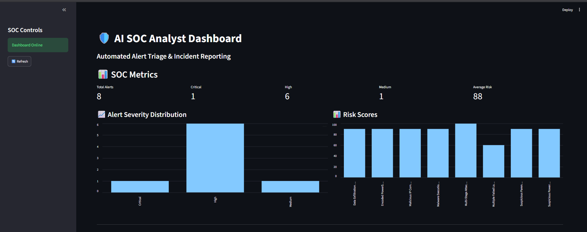
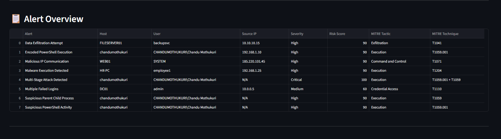
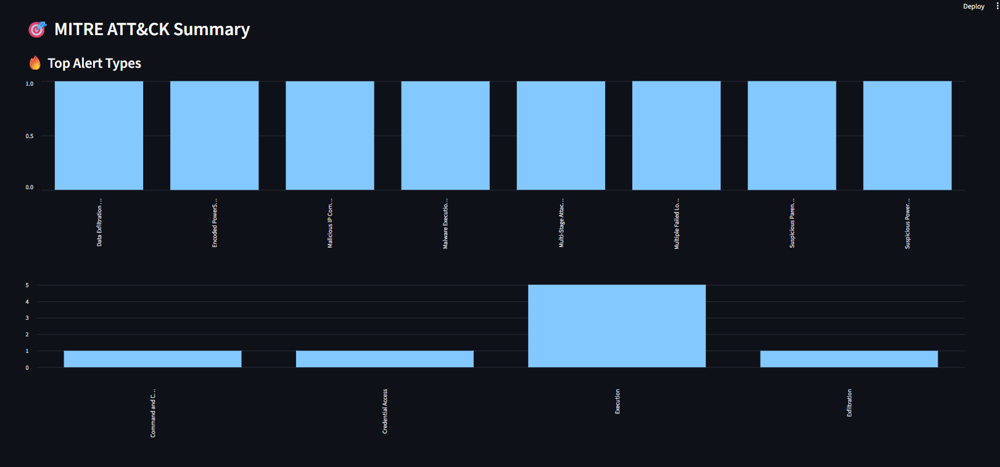
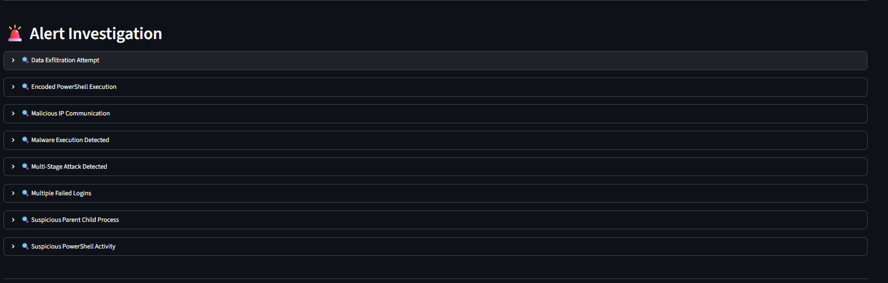
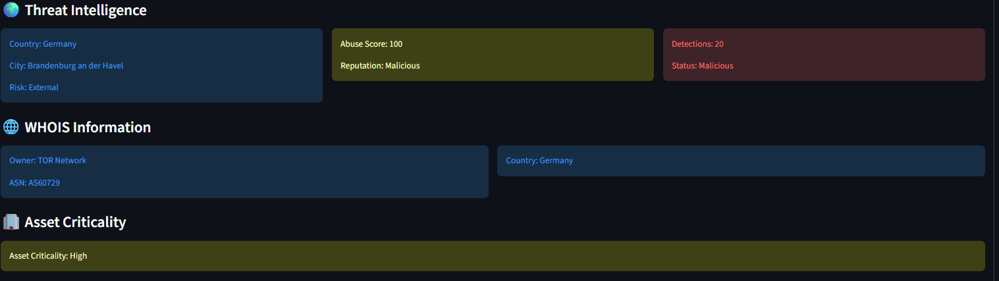
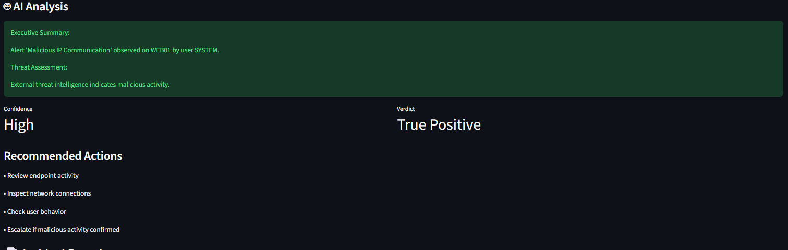
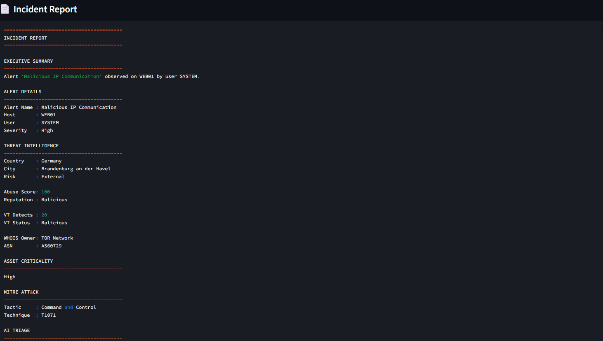

# 🛡️ AI-SOC-Analyst

An AI-powered Security Operations Center (SOC) Analyst platform that ingests real Sysmon EVTX logs, performs threat detection and hunting, correlates alerts, enriches indicators with threat intelligence, maps findings to MITRE ATT&CK, and generates automated incident reports through an interactive Streamlit dashboard.

**Version:** v1.0

---

# 📸 Screenshots

All dashboard screenshots are stored in:

```text
AI-SOC-Analyst/
└── screenshots/
```

### Dashboard Overview



### Alert Overview



### MITRE ATT&CK Summary



### Alert Investigation



### Threat Intelligence



### AI Analysis



### Incident Report



---

# 🚀 Features

## 🔍 Real Sysmon EVTX Ingestion

* Parse real Windows Sysmon EVTX logs
* Extract process creation and security events
* Analyze endpoint activity
* Perform event-driven security monitoring

## 🚨 Detection Engine

* Encoded PowerShell Detection
* Malware Execution Detection
* Multiple Failed Login Detection
* Malicious IP Communication Detection
* Data Exfiltration Detection

## 🎯 Threat Hunting

* Suspicious PowerShell Activity Detection
* LOLBin Detection
* Suspicious Parent-Child Process Detection
* MITRE ATT&CK-aligned hunting logic

## 🔗 Alert Correlation

Correlates multiple alerts into higher-confidence incidents.

### Example

* Encoded PowerShell Execution
* Suspicious Parent Child Process

➡️ Multi-Stage Attack Detected

## 🧠 MITRE ATT&CK Mapping

Automatically maps alerts to MITRE ATT&CK tactics and techniques.

| Alert                           | Tactic              | Technique |
| ------------------------------- | ------------------- | --------- |
| Encoded PowerShell Execution    | Execution           | T1059.001 |
| Multiple Failed Logins          | Credential Access   | T1110     |
| Malicious IP Communication      | Command and Control | T1071     |
| Data Exfiltration Attempt       | Exfiltration        | T1041     |
| Suspicious Parent Child Process | Execution           | T1059     |

## 🌍 Threat Intelligence Enrichment

Integrates multiple intelligence sources:

* GeoIP Analysis
* AbuseIPDB Reputation Checks
* VirusTotal Intelligence
* WHOIS Enrichment

## 🏢 Asset Criticality Analysis

Classifies assets based on business importance:

* Critical
* High
* Medium
* Low

## 🤖 AI Alert Triage

Automatically generates:

* Executive Summary
* Threat Assessment
* Confidence Score
* Verdict
* Analyst Recommendations

## 📄 Automated Incident Reporting

Generates analyst-ready incident reports containing:

* Alert Details
* Threat Intelligence
* Asset Criticality
* MITRE ATT&CK Mapping
* AI Analysis
* Recommended Actions

## 📊 Streamlit SOC Dashboard

Interactive dashboard featuring:

* SOC Metrics
* Alert Overview
* MITRE ATT&CK Summary
* Threat Intelligence
* AI Triage
* Incident Reporting
* Risk Score Analytics

---

# 🏗️ Project Architecture

```text
AI-SOC-Analyst
│
├── alerts/
├── ai/
├── detection/
├── enrichment/
├── parsers/
├── raw_logs/
├── reports/
├── screenshots/
│   ├── dashboard_overview.png
│   ├── alert_overview.png
│   ├── mitre_attack_summary.png
│   ├── alert_investigation.png
│   ├── threat_intelligence.png
│   ├── ai_analysis.png
│   └── incident_report.png
│
├── output/
│
├── dashboard.py
├── run_evtx_detection.py
├── test_hunting.py
├── test_correlation.py
├── requirements.txt
└── README.md
```

---

# 🔬 Detection Workflow

```text
Sysmon EVTX Logs
        │
        ▼
EVTX Parser
        │
        ▼
Detection Engine
        │
        ▼
Threat Hunting Rules
        │
        ▼
Alert Correlation
        │
        ▼
Threat Intelligence
        │
        ▼
MITRE ATT&CK Mapping
        │
        ▼
AI Triage
        │
        ▼
Incident Report
        │
        ▼
SOC Dashboard
```

---

# 🛠️ Tech Stack

## Programming Language

* Python

## Security Technologies

* Sysmon
* MITRE ATT&CK Framework

## Dashboard

* Streamlit

## Data Processing

* EVTX Parsing
* JSON

## Threat Intelligence

* GeoIP
* AbuseIPDB
* VirusTotal
* WHOIS

---

# ▶️ Installation

Clone the repository:

```bash
git clone https://github.com/chandumothukuri/AI-SOC-Analyst.git
cd AI-SOC-Analyst
```

Create a virtual environment:

```bash
python -m venv venv
```

Activate the virtual environment:

### Windows

```bash
venv\Scripts\activate
```

Install dependencies:

```bash
pip install -r requirements.txt
```

---

# ▶️ Run Detection Engine

```bash
python run_evtx_detection.py
```

---

# ▶️ Launch Dashboard

```bash
streamlit run dashboard.py
```

---

# 🎯 Skills Demonstrated

* SOC Operations
* Threat Hunting
* Detection Engineering
* Incident Response
* Threat Intelligence
* MITRE ATT&CK
* Security Monitoring
* Log Analysis
* Python Automation
* Security Analytics
* Alert Correlation
* AI-Assisted Security Analysis

---

# 🔮 Future Improvements

* Sigma Rule Support
* Splunk Integration
* Real-Time Log Streaming
* IOC Management
* Email Alerting
* Detection Coverage Dashboard
* Advanced Threat Intelligence APIs
* SIEM Integration
* SOAR Automation
* Case Management

---

# 👨‍💻 Author

**Chandu Mothukuri**

Cybersecurity Student | SOC Analyst Aspirant | Detection Engineering Enthusiast

GitHub:

https://github.com/chandumothukuri

---

# ⭐ Release

**Current Release: v1.0**

Released: June 2026
